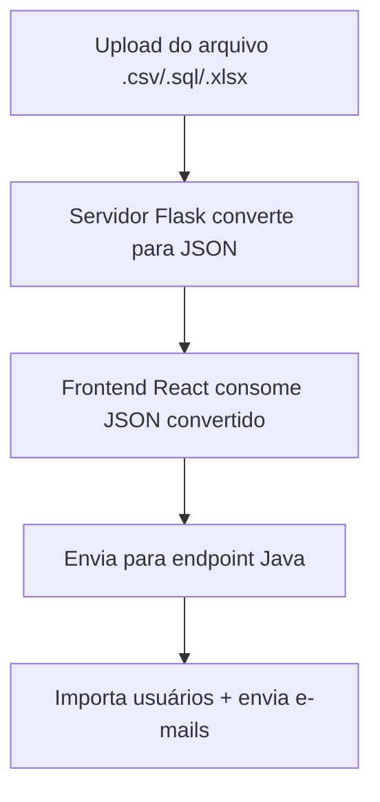

# 🔧 ClassUP Backend API

Backend da aplicação ClassUP com Java Spring Boot.

## 🚀 Tecnologias

- Java
- Spring Boot
- Spring Security (JWT)
- Spring Mail
- Spring Data JPA
- FlywayDB (migração de banco)
- BCrypt (criptografia de senhas)
- MySQL

## 🛠️ Dependências Maven principais

- spring-boot-starter-data-jpa
- spring-boot-starter-mail
- spring-boot-starter-security
- spring-boot-starter-validation
- spring-boot-starter-web
- java-jwt
- flyway-mysql
- mysql-connector-j
- lombok
- spring-boot-starter-test
- spring-security-test

## 📦 Funcionalidade de Importação de Usuários

O sistema possui um mecanismo de **importação automatizada de usuários** (alunos e professores) destinado exclusivamente ao administrador da aplicação.

### 📌 Como funciona:

- A instituição fornece os dados dos usuários em `.csv`, `.json`, `.sql` ou `.xlsx`
- Um script Python (`converterArquivoAPI.py`) processa os arquivos e gera um JSON padronizado
- Esse JSON é enviado para o endpoint `/admin/importar-usuarios`
- O backend gera:
  - Matrícula automática: `ALU12345` ou `PROF67890`
  - Senha numérica de 8 dígitos (criptografada com **BCrypt**)
  - Envio automático de e-mail com as credenciais de acesso

### 🔄 Exemplo do fluxo:



## 📡 Endpoints da API

### 🔐 Autenticação (`/user`)
| Método | Rota                     | Descrição                                 |
|--------|--------------------------|-------------------------------------------|
| POST   | `/user/login`            | Login de usuário                          |
| POST   | `/user/logout`           | Logout do sistema                         |
| GET    | `/user`                  | Buscar perfil do usuário autenticado      |
| PUT    | `/user/email`            | Atualizar e-mail                          |
| PUT    | `/user/senha`            | Atualizar senha                           |
| POST   | `/user/enviar-email`     | Enviar código de redefinição de senha     |
| PUT    | `/user/redefinir-senha`  | Redefinir senha com código enviado        |

---

### 👨‍🏫 Professor (`/professor/sala`)
| Método  | Rota                                      | Descrição                                   |
|---------|-------------------------------------------|---------------------------------------------|
| GET     | `/professor/sala`                         | Listar salas do professor                   |
| POST    | `/professor/sala`                         | Criar nova sala                             |
| GET     | `/professor/sala/{id}`                    | Ver detalhes de uma sala                    |
| POST    | `/professor/sala/encerrar`                | Encerrar semestre                           |
| DELETE  | `/professor/sala/aluno/{alunoId}`         | Remover aluno da sala                       |

#### 📅 Atividades
| Método  | Rota                                              | Descrição                       |
|---------|---------------------------------------------------|---------------------------------|
| POST    | `/professor/sala/atividades`                      | Criar nova atividade            |
| PUT     | `/professor/sala/atividades/{id}`                 | Editar atividade                |
| DELETE  | `/professor/sala/atividades/{id}`                 | Excluir atividade               |
| GET     | `/professor/sala/atividades/{atividadeId}/resumo`| Ver resumo da atividade         |

#### 📢 Avisos
| Método  | Rota                                   | Descrição              |
|---------|----------------------------------------|------------------------|
| POST    | `/professor/sala/avisos`              | Criar novo aviso       |
| PUT     | `/professor/sala/avisos/{id}`         | Editar aviso           |
| DELETE  | `/professor/sala/avisos/{id}`         | Excluir aviso          |

---

### 🎓 Aluno (`/aluno/sala`)
| Método  | Rota                                       | Descrição                         |
|---------|--------------------------------------------|-----------------------------------|
| POST    | `/aluno/sala/entrar`                       | Entrar em uma sala com código     |
| GET     | `/aluno/sala/detalhes`                     | Ver detalhes da sala atual        |
| PUT     | `/aluno/sala/atividades/{id}/confirmar`    | Confirmar presença em atividade   |
| PUT     | `/aluno/sala/atividades/{id}/cancelar`     | Cancelar presença em atividade    |

---

### 🗂️ Histórico (`/sala/historico`)
| Método | Rota                     | Descrição                                |
|--------|--------------------------|------------------------------------------|
| GET    | `/sala/historico`        | Listar salas encerradas do usuário       |
| GET    | `/sala/historico/{id}`   | Ver detalhes de uma sala encerrada       |

### 👨‍💼 Administrador (`/admin`)
| Método | Rota                        | Descrição                                        |
|--------|-----------------------------|--------------------------------------------------|
| POST   | `/admin/registrar`          | Registrar manualmente um novo usuário (admin)    |
| POST   | `/admin/importar-usuarios`  | Importar usuários via JSON processado (admin)    |


## 📦 Instalação

Clone o repositório e instale as dependências:

```bash
mvn clean install
```
Execute o backend:

```bash
mvn spring-boot:run
```
## ⚙️ Configuração local (`application.properties`)

Para rodar o backend localmente, você pode substituir as variáveis de ambiente do `application.properties` por valores fixos. Exemplo:

```properties
# Conexão com o banco de dados local
spring.datasource.url=jdbc:mysql://localhost:3306/classup_db
spring.datasource.username=root
spring.datasource.password=sua_senha
spring.datasource.driver-class-name=com.mysql.cj.jdbc.Driver

# JPA e Hibernate
spring.jpa.hibernate.ddl-auto=update
spring.jpa.show-sql=true
spring.jpa.properties.hibernate.format_sql=true
spring.jpa.database-platform=org.hibernate.dialect.MySQL8Dialect

# Flyway (migração de banco)
spring.flyway.enabled=true
spring.flyway.locations=classpath:db/migration

# Configuração de envio de e-mails (Gmail)
spring.mail.host=smtp.gmail.com
spring.mail.port=587
spring.mail.username=seu_email@gmail.com
spring.mail.password=sua_senha_de_app
spring.mail.properties.mail.smtp.auth=true
spring.mail.properties.mail.smtp.starttls.enable=true

# JWT Secret
API_SECURITY_TOKEN_SECRET=segredo_super_secreto

# Timezone da aplicação
spring.jackson.time-zone=America/Sao_Paulo

# Nível de log da segurança Spring
logging.level.org.springframework.security=DEBUG
```

💡 Para envio de e-mails com Gmail, é necessário gerar uma senha de app em https://myaccount.google.com/security → seção “Senhas de app”.

⚠️ Certifique-se de que o banco classup_db exista no seu MySQL local antes de rodar o projeto.

## 👨‍💻 Autor
Desenvolvido por [Felipe de Paula](https://github.com/felipexxxxx)

---

💬 Dúvidas ou sugestões? Fique à vontade para abrir uma issue no repositório!
